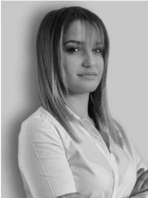
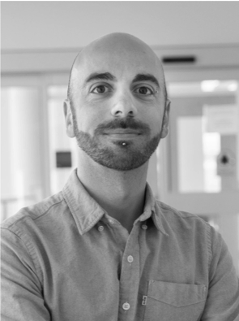

##  Blended Modelling for Software Architectures

On March 13' 2023 we gave a tutorial at the 20th International Conference on Software Architecture ([ICSA](https://icsa-conferences.org/2023)) titled "Blended Modeling for Software Architectures". The tutorial gives a holistic overview of the main scientific contributions of the researchers of the Malardalen University and Vrije Universiteit Amsterdam in the context of the BUMBLE project.

In this tutorial, we demonstrated two major activities in modelling and designing software architectures:

* Given a domain-specific language at hand, we showed how to architect a blended modelling environment for it. From that, we showed how to leverage our framework to semi-automatically generate the blended modelling environment in the tool ecosystem (Eclipse Modeling Framework).

* Once the blended modelling environment is generated, we showed how to architect software systems by using the generated blended modelling environment, demonstrating its seamless synchronization capabilities across different modelling notations and collaborative editing features.

Below we provide all the video content and the slides we used during the tutorial for demonstrating the presented BUMBLE technologies

[Slides](https://drive.google.com/file/d/16RLWhi2SApenDhHRcZNNtoygTTbx0IbH/view?usp=share_link)

  
  <iframe src="/assets/img/ICSA.pdf" width="100%" height="500px">
    </iframe>

Textual to grahical mapping model



Graphical to textual mapping model 



Generation of graphical editor



Complete process 



Cross-platform real-time collaboration between Eclipse EMF and Jetbrains MPS 



## Team:

[Malvina Latifaj](http://www.es.mdu.se/staff/4313-Malvina_Latifaj)

[Muhammad Waseem Anwar](http://www.es.mdu.se/staff/4697-Muhammad_Waseem_Anwar)

[Federico Ciccozzi](https://federicociccozzi.com/)

[Kousar Aslam](https://kousar-aslam.github.io/)

[Ivano Malavolta](https://www.ivanomalavolta.com/)

|[Malvina Latifaj](http://www.es.mdu.se/staff/4313-Malvina_Latifaj) | [Muhammad Waseem Anwar](http://www.es.mdu.se/staff/4697-Muhammad_Waseem_Anwar) |
:-----------------------------------------: | :-----------------------:
|  | ![]/assets/img/waseem.png |

<table>
  <tr>
    <td> 

    <td>
   
    <td>

    <td>
       
    <td>   
  
  </tr>
</table>

