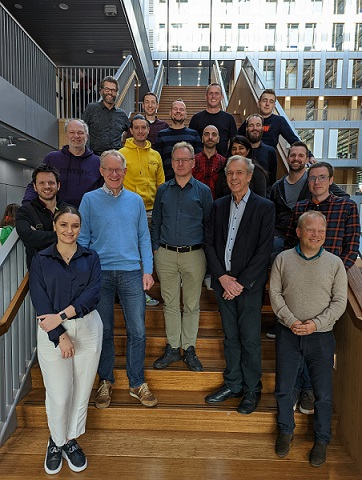
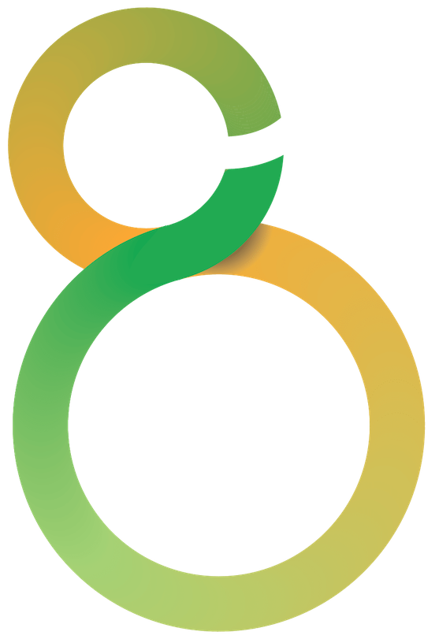

---
---

{: .middle-align}

**Blended modeling** means to allow engineers to freely choose and switch between several different notations for the same domain-specific concepts captured in a DSML. The necessary synchronization techniques are exploited to also support collaborative working on models and DSML evolution.

Traditionally, DSML tools focus on one specific notation (such as text, diagrams, tables or forms). This limits human communication, especially across engineering disciplines. A notation that is well-understood by one engineering discipline may not be understood by engineers from another discipline. Moreover, engineers (from the same or different disciplines) may have different notation preferences; not supporting multiple notations negatively affects engineers’ throughput.

{: .left-align}

The ITEA3 project **BUMBLE** aims for a significant improvement of the current state-of-the-art modeling tools. The ability to freely mix notations is a core ingredient to build suitable DSMLs that support their users for the task at hand. 

The main goal of BUMBLE is to provide reference solutions for the generation and management of full-fledged blended modeling environments from DSMLs. This will support the development of complex heterogeneous systems by enabling seamless textual and graphical collaborative modeling. 

The project focuses specifically on industrial-grade innovations to support:

* Automatic generation of modeling environments for arbitrary DSMLs to support blended graphical-textual modeling with possibility for syntactically incorrect modeling for sketching.
* Automatic synchronization between multiple notations for DSMLs that scales well for large DSML instances to enable powerful and seamless collaborate blended modeling.
* Evolution of DSML definitions (i.e., at the level of domain-specific concepts) and their concrete instances, with special interest on representation-agnostic traceability in situ.

The outcome of BUMBLE will allow the automatic and customized generation of a blended modeling environment from any arbitrary DSML. In addition, automated mechanisms for *(i)* locally keeping the multiple representations in sync, *(ii)* simultaneously editing and versioning models collaboratively using multiple representations, *(iii)* co-evolving the blended modeling environment in response to DSML evolutions, will be provided.

The BUMBLE consortium covers the complete market value chain for model-driven engineering of complex software-intensive systems. The results of BUMBLE will be fed back into multiple communities for state-of-the-art (open-source) DSML technologies enabling interested industries and academia to benefit. BUMBLE selected the DSML technologies of Eclipse and Jetbrains MPS to focus on; other communities will be addressed through dissemination and exploitation activities. The vision of exchanging experiences across different DSML technology communities and across different application domains is reflected by the composition of BUMBLE’s consortium. 
